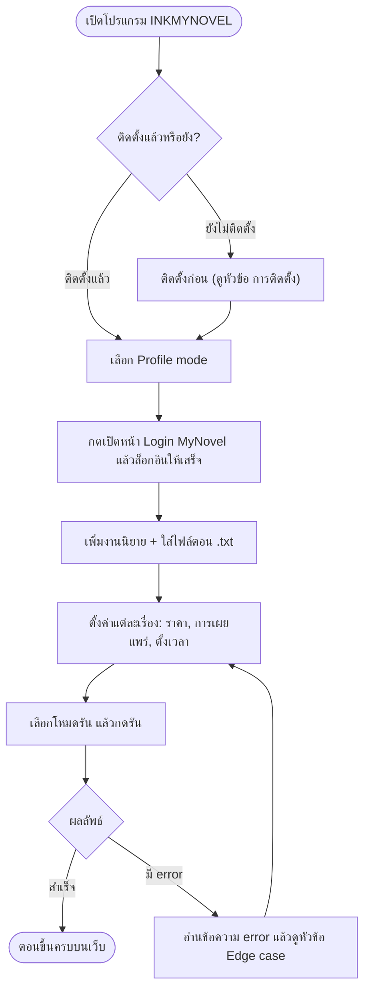
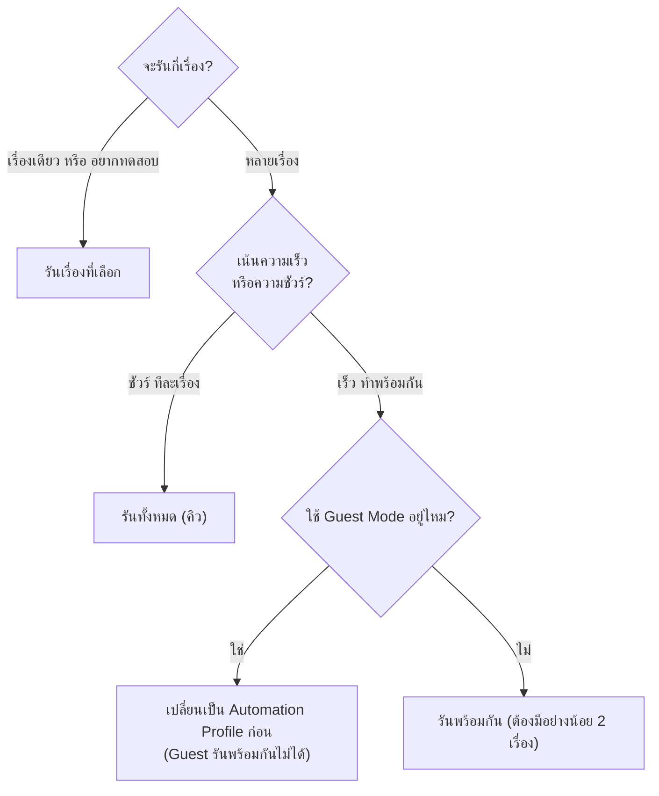
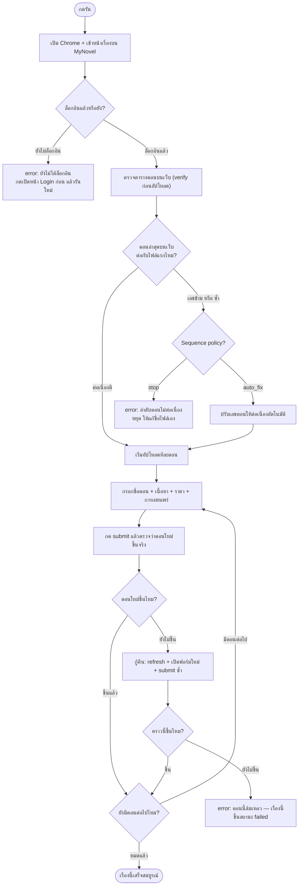

# INKMYNOVEL Uploader

โปรแกรมช่วยอัปโหลดตอนนิยายขึ้นเว็บ [MyNovel](https://mynovel.co) แบบกึ่งอัตโนมัติ
รองรับหลายเรื่องพร้อมกัน ตั้งราคา ตั้งเวลาเผยแพร่ และตรวจสอบตอนซ้ำ/ตอนข้ามให้อัตโนมัติ

ทำงานได้ทั้งบน **Windows** และ **macOS**

---

## สารบัญ

1. [สิ่งที่ต้องมีก่อน](#สิ่งที่ต้องมีก่อน)
2. [การติดตั้ง](#การติดตั้ง)
3. [สร้างไฟล์โปรแกรมเอง (build)](#สร้างไฟล์โปรแกรมเอง-build)
4. [ขั้นตอนการทำงาน (Flowchart)](#ขั้นตอนการทำงาน-flowchart)
5. [วิธีใช้งานทีละขั้น](#วิธีใช้งานทีละขั้น)
6. [โหมดการรัน](#โหมดการรัน)
7. [Profile mode (โหมดโปรไฟล์)](#profile-mode-โหมดโปรไฟล์)
8. [ระบบตรวจสอบตอน](#ระบบตรวจสอบตอน)
9. [รูปแบบไฟล์ตอน](#รูปแบบไฟล์ตอน)
10. [ไฟล์ข้อมูลถูกเก็บไว้ที่ไหน](#ไฟล์ข้อมูลถูกเก็บไว้ที่ไหน)
11. [การอัปเดตโปรแกรม](#การอัปเดตโปรแกรม)
12. [Edge case และการแก้ปัญหา](#edge-case-และการแก้ปัญหา)

---

## สิ่งที่ต้องมีก่อน

- **Google Chrome** — โปรแกรมทำงานโดยขับ Chrome ให้อัปโหลด จึงต้องติดตั้ง Chrome ไว้ในเครื่อง
- **บัญชี MyNovel** ที่มีสิทธิ์ลงตอนในเรื่องที่ต้องการ
- ถ้าจะ **รันจากซอร์สโค้ด** ต้องมี **Python 3.9 ขึ้นไป** เพิ่มด้วย

> ไม่ต้องติดตั้ง chromedriver เอง — โปรแกรมจะดาวน์โหลดตัวที่ตรงกับ Chrome ให้อัตโนมัติ

---

## การติดตั้ง

มี 2 แบบให้เลือกตามความถนัด

### แบบที่ 1 — ใช้ไฟล์โปรแกรมสำเร็จรูป

ง่ายที่สุด ไม่ต้องติดตั้ง Python ได้ไฟล์โปรแกรมจาก [หน้า Releases](https://github.com/snibzyz/inkmynovel/releases/latest)
หรือสร้างเองตามหัวข้อ [สร้างไฟล์โปรแกรมเอง (build)](#สร้างไฟล์โปรแกรมเอง-build)

**บน Windows**
1. ดาวน์โหลด `INKMYNOVEL.exe`
2. ดับเบิลคลิกได้เลย
3. ถ้ามีแถบเตือนของ Windows ขึ้น → กด **More info** → **Run anyway**

**บน macOS**
1. ดาวน์โหลดไฟล์ `.dmg` ให้ตรงกับชิปของเครื่อง
   - Mac ชิป Apple (M1/M2/M3/M4) → `INKMYNOVEL-arm64.dmg`
   - Mac ชิป Intel (รุ่นเก่า) → `INKMYNOVEL-intel.dmg`
2. เปิดไฟล์ `.dmg` แล้วลากแอป `INKMYNOVEL` ไปวางในโฟลเดอร์ `Applications`
3. ครั้งแรกให้ **คลิกขวาที่แอป → Open → Open** (เพื่อผ่านด่าน Gatekeeper)
4. ครั้งต่อ ๆ ไปดับเบิลคลิกได้ตามปกติ

> ไม่แน่ใจว่าเครื่องใช้ชิปอะไร? กดเมนู  ด้านบนซ้าย → **About This Mac** แล้วดูบรรทัด "Chip" หรือ "Processor"

### แบบที่ 2 — รันจากซอร์สโค้ด

เหมาะกับนักพัฒนา หรือต้องการแก้โค้ดเอง ต้องมี Python 3.9+ ก่อน
มีไฟล์ลัด **ดับเบิลคลิกได้เลย** อยู่ที่ root ของโปรเจกต์

**บน Windows**
1. ดับเบิลคลิก `install.bat` — ติดตั้งครั้งแรก (สร้าง `.venv` + ลง dependencies)
2. ดับเบิลคลิก `run.bat` — เปิดโปรแกรม

**บน macOS**
1. ดับเบิลคลิก `install.command` — ติดตั้งครั้งแรก
2. ดับเบิลคลิก `run.command` — เปิดโปรแกรม
3. ครั้งแรกถ้า macOS บล็อก ให้ **คลิกขวาที่ไฟล์ → Open → Open**

หรือสั่งผ่าน terminal เองก็ได้ (ใช้ได้รวมถึง Linux):
```bash
./scripts/install.sh    # ติดตั้งครั้งแรก
./scripts/run.sh        # เปิดโปรแกรม
```

---

## สร้างไฟล์โปรแกรมเอง (build)

แปลงซอร์สโค้ดเป็นไฟล์โปรแกรมไฟล์เดียว (พกพาได้) ด้วย PyInstaller

**บน Windows** → ได้ `dist\INKMYNOVEL.exe`
```bat
scripts\build.bat
```

**บน macOS** → ได้ `dist/INKMYNOVEL.app`
```bash
./scripts/build.sh
```

สคริปต์ build จะติดตั้ง PyInstaller และ dependencies ให้เอง แล้วสั่ง build ตามไฟล์ `INKMYNOVEL.spec`
ผลลัพธ์เป็นไฟล์เดียว แจกจ่ายได้ และเครื่องปลายทางไม่ต้องติดตั้ง Python (แต่ยังต้องมี Chrome)

> ต้อง build แยกตามระบบปฏิบัติการ — build บน Windows ได้ `.exe`, build บน Mac ได้ `.app`
> ไม่สามารถ build ข้ามเครื่องได้

### ออก Release อัตโนมัติ

โปรเจกต์มี GitHub Actions ([.github/workflows/release.yml](.github/workflows/release.yml)) ไว้ build ให้ครบทุกระบบ
เมื่อ push git tag แบบ `vX.Y.Z` ระบบจะ build ให้อัตโนมัติทั้ง `INKMYNOVEL.exe` (Windows),
`INKMYNOVEL-arm64.dmg` (Mac ชิป Apple) และ `INKMYNOVEL-intel.dmg` (Mac ชิป Intel)
แล้วสร้าง Release พร้อมไฟล์ให้ดาวน์โหลด

```bash
git tag v1.0.1
git push origin v1.0.1
```

---

## ขั้นตอนการทำงาน (Flowchart)

### ภาพรวม — ตั้งแต่เปิดโปรแกรมจนอัปโหลดเสร็จ



### เลือกโหมดรันให้เหมาะ



### สิ่งที่เกิดขึ้นตอนกดรัน (รวม edge case)



---

## วิธีใช้งานทีละขั้น

1. **เปิดโปรแกรม**
2. **เลือก Profile mode** ที่ต้องการ (แนะนำ `Automation Profile` — ดู [หัวข้อ Profile mode](#profile-mode-โหมดโปรไฟล์))
3. **เปิดหน้า Login** — กดปุ่ม `เปิดหน้า Login MyNovel` แล้วล็อกอินในหน้าต่าง Chrome ที่เด้งขึ้นมาให้เสร็จ (ล็อกอินครั้งเดียว ใช้ซ้ำได้ทั้งรอบ)
4. **เพิ่มงานนิยาย** จาก panel ด้านซ้าย — เพิ่มได้หลายเรื่อง
5. **ตั้งค่าแต่ละเรื่อง:**
   - ชื่อเรื่อง (คำค้น) หรือ URL เรื่องโดยตรง
   - ไฟล์ตอน `.txt` (เลือกหลายไฟล์ได้)
   - ราคา — ฟรี / ติดเหรียญ / `auto free` (ฟรีตามกติกาเลขตอน)
   - การเผยแพร่ — ร่าง / เผยแพร่ทันที / ตั้งเวลา
   - `Sequence policy` — ให้แก้เลขตอนอัตโนมัติ หรือหยุดเมื่อเจอลำดับผิด
6. **เลือกโหมดรัน** (ดู [โหมดการรัน](#โหมดการรัน)) แล้วกดปุ่มรัน

---

## โหมดการรัน

| โหมด | ทำอะไร | เหมาะกับ |
|---|---|---|
| **รันเรื่องที่เลือก** | รันเฉพาะงานที่เลือกอยู่ในรายการ | ทดสอบ/แก้ทีละเรื่อง |
| **รันทั้งหมด (คิว)** | รันทุกงานทีละเรื่องบน flow เดียว | หลายเรื่อง เน้นชัวร์ |
| **รันพร้อมกัน** | รันหลายงานพร้อมกัน เปิด browser แยกต่อเรื่อง | หลายเรื่อง เน้นเร็ว |

> โหมด `รันพร้อมกัน` ต้องมีอย่างน้อย **2 เรื่อง** และ **ใช้ Guest Mode ไม่ได้** —
> แนะนำให้ใช้คู่กับ `Automation Profile`

---

## Profile mode (โหมดโปรไฟล์)

ก่อนรัน เลือกได้ว่าจะให้โปรแกรมใช้ Chrome profile แบบไหน

| โหมด | ใช้ตอนไหน |
|---|---|
| **Automation Profile** *(แนะนำ)* | โปรไฟล์เฉพาะของโปรแกรม เก็บ login ไว้ใช้ซ้ำ — เหมาะกับงานประจำและโหมดรันพร้อมกัน |
| **Installed Profile** | ใช้ Chrome profile ที่มีอยู่ในเครื่อง (เลือกจากรายการที่ตรวจเจอ) |
| **Guest Mode** | โปรไฟล์ชั่วคราว ต้องล็อกอินใหม่ทุกครั้ง — ใช้โหมดรันพร้อมกันไม่ได้ |
| **Custom Folder** | ระบุโฟลเดอร์ Chrome profile เอง |

### Automation Profile ทำงานยังไง

`automation_profile/` คือโฟลเดอร์เฉพาะเครื่องที่เก็บ Chrome profile สำหรับงาน automation

- เก็บ session login ของ MyNovel ไว้ใช้ซ้ำ ไม่ต้อง login ใหม่ทุกครั้ง
- เป็นต้นทางให้โหมด `รันพร้อมกัน` เปิด browser แยกต่อเรื่อง

โฟลเดอร์นี้มี cookie / session ของผู้ใช้จริง ดังนั้น **ไม่ควร push ขึ้น git และไม่ควรแชร์ให้คนอื่น**
(`.gitignore` กันไว้ให้แล้ว)

---

## ระบบตรวจสอบตอน

ก่อนและหลังอัปโหลดแต่ละตอน โปรแกรมจะอ่านตารางตอนจากหน้า MyNovel แล้วตรวจสอบว่า:

- ตอนล่าสุดบนเว็บต่อเนื่องกับไฟล์แรกที่จะอัปโหลด
- ไม่ได้กำลังลงตอนซ้ำกับตอนล่าสุดบนเว็บ
- หลัง submit แต่ละตอน เว็บมีตอนใหม่เพิ่มขึ้นจริง

เป้าหมายคือลดปัญหา **ข้ามตอน · ลงไม่ครบ · ลงซ้ำ · หน้าเว็บค้างแล้วสคริปต์วิ่งต่อผิดลำดับ**

**ถ้าเจอลำดับตอนผิด** โปรแกรมจะทำตาม `Sequence policy` ของเรื่องนั้น:

- **`auto_fix`** *(ค่าเริ่มต้น)* — ปรับเลขตอนให้ต่อเนื่องอัตโนมัติแล้วอัปโหลดต่อ
- **`stop`** — หยุดทันที แล้วแจ้งให้แก้ชื่อไฟล์เอง

---

## รูปแบบไฟล์ตอน

แนะนำให้ใช้ไฟล์ `.txt` หนึ่งไฟล์ต่อหนึ่งตอน:

- **บรรทัดแรก** = ชื่อตอน
- **บรรทัดถัดไป** = เนื้อหาตอน
- ชื่อไฟล์หรือชื่อตอนควรมีเลขตอน เช่น `ตอนที่ 486` เพื่อให้ระบบ verify ทำงานแม่นยำขึ้น

---

## ไฟล์ข้อมูลถูกเก็บไว้ที่ไหน

ไฟล์ข้อมูลของผู้ใช้ (`config.json`, `inkxmynovel_novel_list.txt`, `inkxmynovel_progress_*.txt`, `automation_profile/`)
ถูกเก็บไว้คนละที่กันตามวิธีรัน:

| วิธีรัน | ตำแหน่งที่เก็บข้อมูล |
|---|---|
| รันจากซอร์สโค้ด | โฟลเดอร์โปรเจกต์ (ข้างไฟล์ `inkxmynovel_pyqt.py`) |
| ไฟล์โปรแกรมสำเร็จรูป — Windows | `%APPDATA%\INKMYNOVEL\` |
| ไฟล์โปรแกรมสำเร็จรูป — macOS | `~/Library/Application Support/INKMYNOVEL/` |

ไฟล์เหล่านี้เป็นข้อมูลเฉพาะเครื่อง ไม่ถูก push ขึ้น git

---

## การอัปเดตโปรแกรม

ทุกครั้งที่เปิดโปรแกรม INKMYNOVEL จะเช็คเวอร์ชันล่าสุดจาก [GitHub Releases](https://github.com/snibzyz/inkmynovel/releases) ให้อัตโนมัติ
ทำงานทั้งตอนรันจากซอร์สโค้ดและตอนรันจากไฟล์โปรแกรม (`.exe` / `.app`)

- ถ้ามีเวอร์ชันใหม่ จะมีหน้าต่างแจ้งเตือนขึ้นมา พร้อมปุ่มเปิดหน้าดาวน์โหลด
- ถ้าไม่มีเน็ตหรือเช็คไม่สำเร็จ โปรแกรมจะข้ามไปเงียบ ๆ ไม่กระทบการใช้งาน
- เวอร์ชันที่ใช้อยู่แสดงบนแถบหัวหน้าต่าง เช่น `INKMYNOVEL v1.0.0`

เลขเวอร์ชันมาจากไฟล์ `VERSION` ที่ root ของโปรเจกต์ ตอน build ผ่าน GitHub Actions
ระบบจะเขียนเลขเวอร์ชันจาก git tag ลงไฟล์นี้ให้อัตโนมัติ

> การเช็คดูเฉพาะเลขเวอร์ชันล่าสุดของ release เท่านั้น ไม่ได้ส่งข้อมูลส่วนตัวออกไป

---

## Edge case และการแก้ปัญหา

โปรแกรมออกแบบให้ **"พยายามกู้คืนเองก่อน แล้วค่อยแจ้ง error"** ตารางด้านล่างรวมสถานการณ์ที่อาจเจอ
แยกตามขั้นตอน พร้อมความหมายและวิธีแก้

### ตอนติดตั้ง / เปิดโปรแกรม

| อาการ | สาเหตุ / ความหมาย | วิธีแก้ |
|---|---|---|
| โปรแกรมหา Chrome ไม่เจอ | ยังไม่ได้ติดตั้ง Chrome หรืออยู่ที่ไม่มาตรฐาน | ติดตั้ง Google Chrome หรือกดเลือก path เอง |
| macOS เตือนว่าแอป "เสียหาย" / เปิดไม่ได้ | ยังไม่ผ่าน Gatekeeper | คลิกขวาที่แอป → Open → Open หรือสั่ง `xattr -cr INKMYNOVEL.app` |
| `.command` / `.sh` รันไม่ได้ (Permission denied) | ไฟล์ไม่มีสิทธิ์รัน | สั่ง `chmod +x install.command run.command scripts/*.sh` |
| ตั้งค่าเดิมหาย | ไฟล์ `config.json` เสีย | โปรแกรมจะเริ่มด้วยงานเปล่า 1 งานให้ — ตั้งค่าใหม่ได้เลย |

### Login & Profile

| อาการ | ความหมาย | วิธีแก้ |
|---|---|---|
| `ยังไม่ได้ล็อกอิน` | ยังอยู่หน้า login ตอนจะอัปโหลด | กดเปิดหน้า Login → ล็อกอินให้เสร็จ → รันใหม่ |
| `เปิด Chrome profile ไม่สำเร็จ` | profile นั้นถูกเปิดค้างใน Chrome อื่นอยู่ | ปิด Chrome ที่ใช้ profile เดียวกัน หรือเปลี่ยนเป็น Automation Profile |
| `กรุณาเลือก Custom profile folder` | เลือกโหมด Custom แต่ไม่ได้ใส่ path | กด Browse เลือกโฟลเดอร์ profile |
| `ไม่พบโฟลเดอร์ Chrome profile` | path ที่ใส่ไม่มีอยู่จริง | ตรวจสอบ path ให้ถูกต้อง |
| เปลี่ยนหน้า dashboard ไม่ได้ | เน็ตหลุด หรือ session หมดอายุ | เช็กเน็ต / ล็อกอินใหม่ |

### หาเรื่อง & URL

| อาการ | ความหมาย | วิธีแก้ |
|---|---|---|
| `ไม่พบเรื่อง '...'` | คำค้นชื่อเรื่องไม่ตรงกับบนเว็บ | พิมพ์ชื่อให้ตรง หรือใส่ URL เรื่องโดยตรง |
| URL เรื่องใช้ไม่ได้ | URL ผิดหรือเปลี่ยน | โปรแกรมจะ fallback ไปค้นจากชื่อเรื่องให้อัตโนมัติ |

### ลำดับตอน (Sequence)

| อาการ | ความหมาย | วิธีแก้ |
|---|---|---|
| `ลำดับตอนไม่ต่อเนื่อง` | เลขตอนไฟล์แรก ≠ ตอนล่าสุดบนเว็บ + 1 | policy `auto_fix` จะแก้เลขให้เอง / policy `stop` จะหยุดให้แก้ชื่อไฟล์ |
| `ตอนล่าสุดบนเว็บซ้ำกับไฟล์แรก` | ไฟล์แรกมีชื่อตรงกับตอนที่ลงไปแล้ว | `auto_fix` ปรับให้ / `stop` หยุด — ลบหรือข้ามไฟล์แรกถ้าซ้ำจริง |
| `ไม่พบตารางตอนเดิมบนเว็บ` | เรื่องยังไม่มีตอน หรืออ่านตารางไม่ได้ | ข้ามการตรวจ ใช้ชื่อตอนตามไฟล์ (ไม่ใช่ error) |

### ระหว่างอัปโหลด

| อาการ | ความหมาย | วิธีแก้ |
|---|---|---|
| ฟอร์มบนเว็บโหลดไม่ทัน / element หาย | หน้าเว็บช้า หรือ MyNovel ปรับ UI | โปรแกรม retry ให้อัตโนมัติ ถ้ายังพังให้ลองรันใหม่ |
| `ยืนยันหลังอัปโหลดไม่ผ่าน` | submit แล้วตอนใหม่ยังไม่ขึ้น | โปรแกรม refresh + เปิดฟอร์มใหม่ + submit ซ้ำให้อัตโนมัติ |
| ตอนหนึ่งล้มเหลว | กู้คืนแล้วยังไม่ขึ้น | เรื่องนั้นขึ้นสถานะ `failed` — รันซ้ำเฉพาะเรื่องที่ค้างได้ |

### โหมดรันพร้อมกัน

| อาการ | ความหมาย | วิธีแก้ |
|---|---|---|
| `ต้องมีอย่างน้อย 2 งาน` | กดรันพร้อมกันแต่มีเรื่องเดียว | เพิ่มเรื่อง หรือใช้โหมดคิวแทน |
| `Guest Mode ไม่เหมาะกับการรันพร้อมกัน` | Guest แชร์ login ข้าม browser ไม่ได้ | เปลี่ยนเป็น Automation / Installed / Custom |
| `งานที่เลือกมีอยู่ในคิวแล้ว` | กดรันงานที่กำลังรันหรือรออยู่ | รอให้เสร็จ หรือเอาออกจากคิวก่อน |
| มีบางงานไม่สำเร็จ | บางเรื่อง error ระหว่างรันชุดใหญ่ | ดูสรุปท้ายงาน แล้วรันซ้ำเฉพาะเรื่องที่ `failed` |

### ตั้งเวลาเผยแพร่ (Schedule)

| อาการ | ความหมาย | วิธีแก้ |
|---|---|---|
| ตั้งเวลาข้ามเที่ยงคืน | เช่นเริ่ม 22:00 เว้นห่าง 4 ชม. | โปรแกรมเลื่อนเป็นวันถัดไปให้เองอัตโนมัติ |
| ช่วง skip คร่อมเที่ยงคืน | `skip_start` มากกว่า `skip_end` | ระบบเข้าใจว่าเป็นช่วงข้ามคืน จัดการให้เอง |
| `ปีเกินปีปัจจุบัน` | ตั้งวันเผยแพร่เป็นปีอนาคตไกล | ยืนยันถ้าตั้งใจ หรือแก้วันที่ |

### ยังกรอกข้อมูลไม่ครบ

| อาการ | วิธีแก้ |
|---|---|
| `กรุณาเลือกงานนิยายก่อน` | คลิกเลือกงานในรายการด้านซ้าย |
| `กรุณาเลือกไฟล์นิยายของเรื่องนี้ก่อน` | กดเลือกไฟล์ `.txt` ของเรื่องนั้น |
| `กรุณาระบุชื่อนิยายสำหรับค้นหา` | ใส่ชื่อเรื่อง หรือ URL เรื่อง |
| `กรุณาเพิ่มนิยายอย่างน้อย 1 งาน` | กดปุ่มเพิ่มนิยายก่อน |

---

## โครงสร้างโปรเจกต์

| ไฟล์ / โฟลเดอร์ | หน้าที่ |
|---|---|
| `inkxmynovel_pyqt.py` | โค้ดหลักของโปรแกรม |
| `VERSION` | เลขเวอร์ชันของโปรแกรม |
| `requirements.txt` | แพ็กเกจที่ต้องติดตั้ง (`selenium`, `PyQt6`) |
| `INKMYNOVEL.spec` | ค่าตั้งสำหรับ build เป็นไฟล์โปรแกรมด้วย PyInstaller |
| `install.* · run.*` (ที่ root) | ไฟล์ลัดดับเบิลคลิก — ติดตั้ง / เปิดโปรแกรม |
| `scripts/` | สคริปต์ install · run · build (`.bat` = Windows, `.sh` = macOS/Linux) |
| `.github/workflows/release.yml` | build อัตโนมัติ + ออก Release |

---

## License

ใช้งานภายในหรือปรับแต่งต่อได้ตามความเหมาะสม
